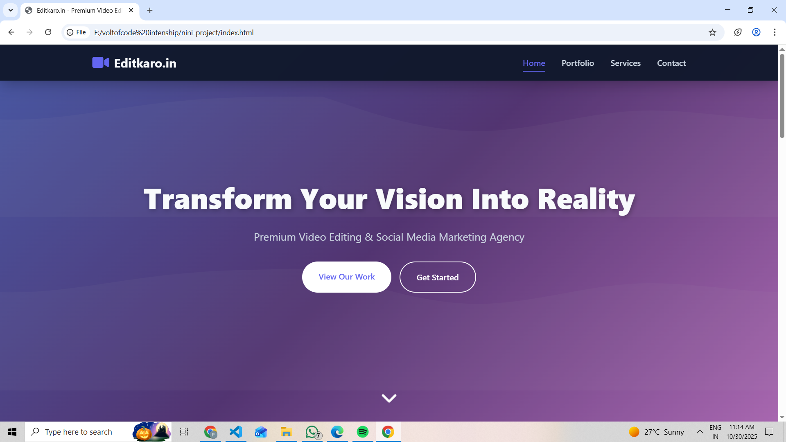
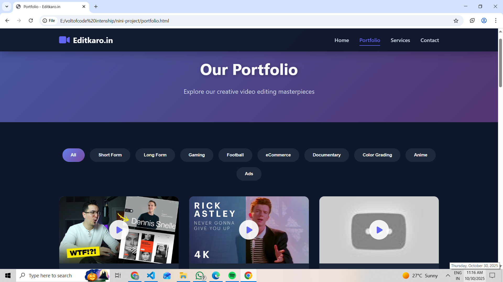
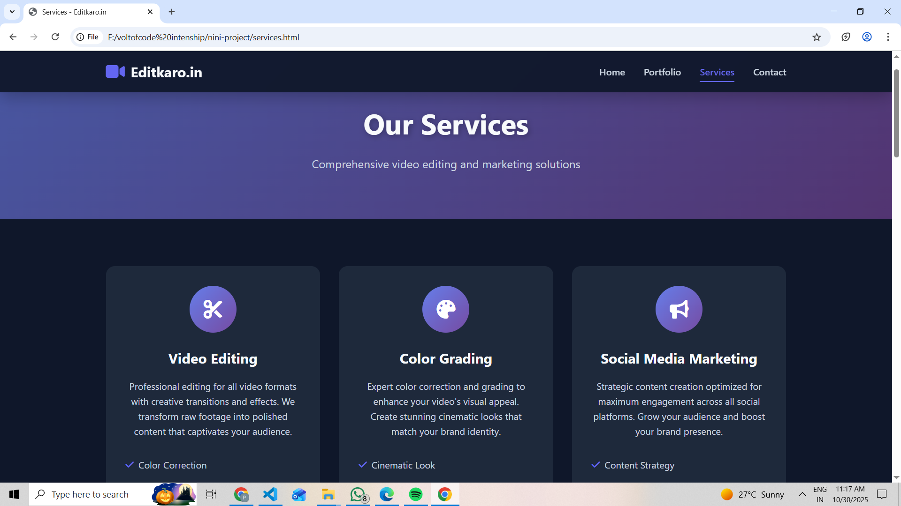
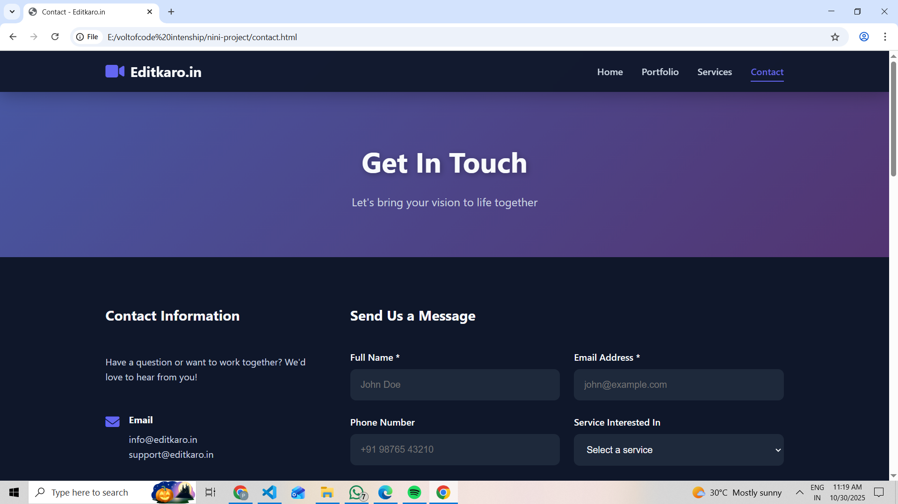

# Editkaro.in - Premium Video Editing & Social Media Marketing 🎬


A modern, fully responsive website for a premium video editing and social media marketing agency. Built with vanilla HTML, CSS, and JavaScript featuring smooth animations, dynamic portfolio filtering, and an elegant user interface.

---

## 📸 Screenshots

### 🏠 Home Page

*Beautiful gradient hero section with animated call-to-action buttons and smooth parallax effects*

### 🎬 Portfolio Page

*Interactive filterable portfolio with 10 categories showcasing video projects*

### 💼 Services Page

*Comprehensive service offerings with detailed feature lists and hover animations*

### 📧 Contact Page

*Professional contact form with validation, contact information, and FAQ section*

---

## 🎥 Demo Video

> **Coming Soon:** Demo video will be added here

 


## ✨ Features

- ✅ **Fully Responsive** - Works seamlessly on desktop, tablet, and mobile devices
- ✅ **Dynamic Portfolio** - Filterable video gallery with 10 categories
- ✅ **Video Modal** - YouTube video integration with smooth modal player
- ✅ **Animated Statistics** - Counter animations triggered on scroll
- ✅ **Contact Form** - Professional form with validation
- ✅ **Smooth Animations** - Intersection Observer API for scroll animations
- ✅ **Modern UI/UX** - Glassmorphism effects and gradient designs
- ✅ **Fast Performance** - Optimized images, lazy loading, debounced events
- ✅ **Mobile Menu** - Hamburger navigation for mobile devices
- ✅ **SEO Friendly** - Semantic HTML5 markup

---

## 🚀 Pages

| Page | Description |
|------|-------------|
| **Home** | Hero section, statistics, about section, why choose us, and CTA |
| **Portfolio** | Filterable video showcase with 10 categories and modal player |
| **Services** | 9 comprehensive service listings with detailed features |
| **Contact** | Contact form, information, social links, and FAQ section |

---

## 🛠️ Technologies Used

| Technology | Purpose |
|------------|---------|
| **HTML5** | Semantic markup and structure |
| **CSS3** | Styling with Grid, Flexbox, animations |
| **JavaScript (ES6+)** | Dynamic functionality and interactions |
| **Font Awesome 6.4.0** | Icon library |
| **YouTube Embed API** | Video embedding |

---

## 📁 Project Structure

```
editkaro.in/
│
├── index.html              # Home page
├── portfolio.html          # Portfolio page with video gallery
├── services.html           # Services page
├── contact.html            # Contact page
├── styles.css              # Main stylesheet
├── script.js               # JavaScript functionality
├── README.md               # Documentation (this file)
│
└── screenshots/            # Project screenshots
    ├── home.png
    ├── portfolio.png
    ├── services.png
    ├── contact.png
    └── demo.gif            # (Optional) Demo video
```

---

## 🎯 Portfolio Categories

The portfolio page features a filterable video gallery with the following categories:

- 📱 **Short Form** - Instagram Reels, TikTok, YouTube Shorts
- 📹 **Long Form** - YouTube videos, tutorials, video essays
- 🎮 **Gaming** - Gaming montages, stream highlights, esports content
- ⚽ **Football** - Match highlights, player profiles, sports edits
- 🛒 **eCommerce** - Product videos, promotional ads, demos
- 📚 **Documentary** - Documentary-style videos, corporate content
- 🎨 **Color Grading** - Professional color correction showcases
- 🎭 **Anime** - Anime edits, AMVs, compilations
- 📺 **Ads** - Commercial advertisements, brand campaigns

---

## 💼 Services Offered

1. **Video Editing** - Professional editing with creative transitions
2. **Color Grading** - Cinematic color correction and grading
3. **Social Media Marketing** - Strategic content for all platforms
4. **Motion Graphics** - 2D/3D animations and visual effects
5. **eCommerce Ads** - Product videos that drive conversions
6. **Gaming Content** - High-energy gaming videos and montages
7. **Sports Edits** - Dynamic football and sports highlights
8. **Documentary Style** - Professional storytelling content
9. **Short Form Videos** - Viral-ready content for social media

---

## 🚀 Getting Started

### Prerequisites
- A modern web browser (Chrome, Firefox, Safari, Edge)
- Basic text editor (VS Code recommended)
- Local server (optional, for development)

### Installation

1. **Clone the repository**
   ```bash
   git clone https://github.com/prassi05/editkaro.in.git
   ```

2. **Navigate to project directory**
   ```bash
   cd editkaro.in
   ```

3. **Open in browser**
   ```bash
   # Option 1: Direct file
   open index.html
   
   # Option 2: Using Python server
   python -m http.server 8000
   # Then visit: http://localhost:8000
   
   # Option 3: Using Node.js
   npx serve
   ```

---

## ⚙️ Customization

### 1️⃣ Update Portfolio Videos

Edit `script.js` and modify the `portfolioData` array:

```javascript
const portfolioData = [
    {
        id: 1,
        title: "Your Video Title",
        category: "gaming", // Category name
        videoId: "YOUR_YOUTUBE_VIDEO_ID",
        thumbnail: "https://img.youtube.com/vi/YOUR_VIDEO_ID/maxresdefault.jpg"
    },
    // Add more videos...
];
```

### 2️⃣ Change Color Scheme

Edit `:root` variables in `styles.css`:

```css
:root {
    --primary-color: #6366f1;      /* Main brand color */
    --secondary-color: #8b5cf6;    /* Secondary color */
    --accent-color: #ec4899;       /* Accent color */
    --dark-bg: #0f172a;            /* Background */
    --dark-surface: #1e293b;       /* Card background */
    --text-primary: #f8fafc;       /* Main text */
    --text-secondary: #cbd5e1;     /* Secondary text */
}
```

### 3️⃣ Update Contact Information

Edit `contact.html` to update:
- Email addresses
- Phone numbers
- Location
- Working hours
- Social media links

### 4️⃣ Modify Services

Edit `services.html` to add, remove, or modify service cards.

---

## 📱 Responsive Design

The website is fully responsive with breakpoints at:

| Device | Width | Layout |
|--------|-------|--------|
| **Desktop** | > 768px | Full navigation, multi-column grids |
| **Tablet** | 481px - 768px | Adapted layouts, readable content |
| **Mobile** | < 480px | Single column, hamburger menu |

---

## ⚡ Performance Features

- ✅ **Lazy Loading** - Images load as they enter viewport
- ✅ **Debounced Scrolling** - Optimized scroll event handlers
- ✅ **Intersection Observer** - Efficient animation triggers
- ✅ **Minimal Repaints** - CSS optimizations for smooth animations
- ✅ **Compressed Assets** - Optimized images and code

---

## 🎨 Design Features

- **Gradient Backgrounds** - Beautiful purple-pink gradients
- **Glassmorphism** - Modern frosted glass effects
- **Smooth Animations** - CSS transitions and keyframe animations
- **Hover Effects** - Interactive card and button states
- **Modal Overlays** - Professional video player modals
- **Parallax Scrolling** - Subtle depth effects

---

## 🌐 Browser Support

| Browser | Version |
|---------|---------|
| Chrome | ✅ Latest |
| Firefox | ✅ Latest |
| Safari | ✅ Latest |
| Edge | ✅ Latest |
| Opera | ✅ Latest |

---

## 📝 License

This project is created for **VaultofCodes**. All rights reserved © 2025 Editkaro.in

---

## 👨‍💻 Author

**Designed and Developed with ❤️ for VaultofCodes**

---

## 🤝 Contributing

Contributions are welcome! If you'd like to contribute:

1. Fork the repository
2. Create a feature branch (`git checkout -b feature/AmazingFeature`)
3. Commit your changes (`git commit -m 'Add some AmazingFeature'`)
4. Push to the branch (`git push origin feature/AmazingFeature`)
5. Open a Pull Request

---

## 📞 Contact

**Editkaro.in** - Premium Video Editing Agency

- 📧 Email: info@editkaro.in
- 📱 Phone: +91 98765 43210
- 📍 Location: Pondicherry, India
- 🌐 Website: [editkaro.in](https://editkaro.in)

### Social Media
- 📸 [Instagram](https://instagram.com/editkaro.in)
- 🎥 [YouTube](https://youtube.com/@editkaro)
- 💼 [LinkedIn](https://linkedin.com/company/editkaro)
- 🐦 [Twitter](https://twitter.com/editkaro)

---

## 🙏 Acknowledgments

- Font Awesome for the icon library
- Google Fonts for typography
- YouTube for video embedding
- VaultofCodes for the opportunity

---

## 📊 Project Stats


---

<div align="center">

### ⭐ Star this repository if you find it helpful!

**Made with ❤️ for VaultofCodes** | © 2025 Editkaro.in


</div>

